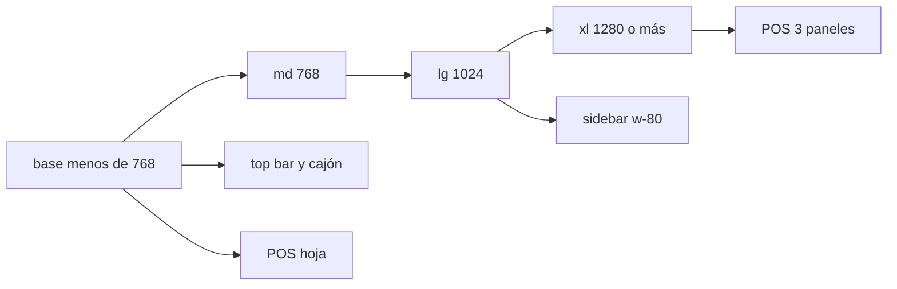

# Plan: breakpoints responsivos

## En una frase

Bajar el layout a 402, 768 y 1024 usando los cortes de Tailwind, sin tocar el escritorio ancho actual.

## Lo que ya funciona

- Tailwind 4 va mobile-first. No hay screens custom: `md` = 768 y `lg` = 1024 ya coinciden con tablet y Desktop-1.
- El shell ya cambia en `lg`: hamburguesa + cajón abajo; sidebar fija arriba.
- Login, registro y sucursales viven en una columna estrecha. Encajan en 402.
- Los diálogos Catalyst ya son hoja inferior en móvil y tarjeta en `sm+`.
- Listados simples (clientes, categorías, proveedores) apilan título y botón bajo `sm` y tienen scroll horizontal.
- El POS ya tiene grilla 2 / 3 / 4 / 5 y chips con scroll. El carrito inline existe bajo `lg`.
- Desktop-2 (pantalla ancha de hoy) está bien. No se rediseña.

## Los 5 problemas

1. **No hay contrato de cortes.** 402 no es un token (y no debe serlo). `md` casi no se usa para layout. A los 1024 px el chrome de escritorio ancho se enciende entero.

2. **El POS no cabe en Desktop-1.** Sidebar + carrito fijo dejan ~300 px para el catálogo y piden 4 columnas. En 402 y 768 el carrito va al fondo de un contenedor sin overflow y puede recortar «Continuar».

3. **Las tablas densas asumen Desktop-2.** Productos usa `table-fixed` de 9 columnas. Caja no hace scroll horizontal y la barra de fechas es `flex-nowrap`.

4. **Hojas laterales y filtros no tienen un patrón único.** Detalle de venta, abrir caja y editar venta son `max-w-md` fijos. En 1024 el detalle de venta no pone velo. Cada módulo inventa su toolbar.

5. **Falta un kit compartido.** Sin tokens documentados y sin receta de tabla / filtro / hoja, el resto de pantallas se va a parchear una por una.

## Qué hay que hacer

1. Fijar el mapa en un comentario de `globals.css`: 402 = base, 768 = `md`, 1024 = `lg`, Desktop-2 = `xl+`. No crear un screen de 402 px.
2. Endurecer el shell: hamburguesa bajo `lg` (ya está). Perfil compacto en la top bar. Sin barra inferior nueva.
3. POS: reservar la columna derecha solo desde `xl`. Bajo `xl`, carrito y checkout en hoja / cajón con CTA siempre visible. En `lg` bajar la grilla a 3 columnas. No tocar `xl:grid-cols-5`.
4. Productos: mostrar columnas de a poco (nombre + precio + stock en 402; más en `md`; todas en `xl`). Quitar `table-fixed` en móvil. Reusar el truco de empleados (`hidden … lg:table-cell`).
5. Caja: pasar filtros a `flex-wrap` (como estadísticas). Scroll o columnas ocultas en transacciones. Hojas a ancho completo en 402, con velo también en `lg`.
6. Copiar el mismo patrón a clientes, proveedores, categorías, etiquetas, empleados y roles.
7. Formularios y diálogos: `Nuevo producto` (`size="3xl"`) debe scrollear bien a 402. Horario y marca ya apilan; solo revisar overflow.
8. Verificar a 402, 768, 1024 y el escritorio ancho actual (≈1440+). Estadísticas: no romper; no bloquear el resto.

## Fuera de alcance

- Rediseñar Desktop-2, la paleta o el glass.
- Inventar una bottom nav.
- Terminar estadísticas (hay error de runtime; está en progreso).
- Inventario, movimientos, cuentas por cobrar y por pagar (placeholders).
- Usar `OrgsShell` (existe y no se monta; sucursales usa el layout de auth).

## Anexo: referencias técnicas

### Mapa de cortes (recomendado)

| Pedido | Ancho | Token Tailwind | Qué se ve |
| --- | --- | --- | --- |
| Móvil | 402 | sin prefijo (base) | Top bar + cajón. Tablas reducidas. POS en hoja. |
| Tablet | 768 | `md` (48rem) | Misma chrome. Grids 2–3. Más columnas de tabla. |
| Desktop-1 | 1024 | `lg` (64rem) | Sidebar de listados. POS **sin** columna de 384 px. |
| Desktop-2 | actual | `xl`+ (80rem+) | Como hoy: sidebar + carrito `w-96` + grilla 5. |

Por qué no crear screens `402` / `tablet` / `desktop`:

- 402 es el **piso** mobile-first, no un `min-width`. Un `--breakpoint-phone: 25.125rem` casi no se usaría, o empujaría a `max-*` (pelea con el sistema).
- `md` y `lg` ya son 768 y 1024. Alias (`tablet:`, `desktop:`) solo renombran y mueven todas las clases.
- DAIEGO UI: si no hay tokens `tablet:` / `desktop:`, usar `sm` / `md` / `lg`. Este repo no los tiene.
- `sm` (640) se queda para tipo y padding de Catalyst (`text-base` → `sm:text-sm`). No es un corte de producto.

Si se quiere el nombre en el CSS, un comentario basta. No cambiar `--breakpoint-*` salvo que el token sea idéntico a `md`/`lg` y no altere Desktop-2.

### Dónde está el layout hoy

- Shell: `styles/catalyst-ui-kit/sidebar-layout.tsx` — `lg:hidden` top bar; `lg:w-80` sidebar; `lg:pl-80`; carrito `w-96` + `lg:pr-96` + `lg:flex`.
- Nav: `components/org-dashboard-shell.tsx` — reserva la columna derecha solo en `/pos`.
- POS: `components/pos/pos-panel.tsx` — grilla `grid-cols-2 sm:3 lg:4 xl:5`; carrito inline `lg:hidden` en un flex `overflow-hidden`.
- Checkout: `components/pos/pos-checkout-panel.tsx` — métodos en `grid-cols-2` (vale en 402 si vive en hoja, no al pie del catálogo).
- Productos: `components/productos/products-panel.tsx` — `table-fixed` + `w-[18%]`…`w-[10%]`.
- Caja: `components/caja/balance-panel.tsx` — toolbar `flex-nowrap`; tablas `overflow-hidden` sin `overflow-x-auto`.
- Hojas: `sale-detail-sidebar.tsx` (velo `lg:hidden`), `cash-session-sidebar.tsx`, `edit-sale-dialog.tsx` — `fixed … max-w-md`.
- Diálogos: `styles/catalyst-ui-kit/dialog.tsx` — hoja `rounded-t-3xl` / `sm:rounded-3xl`.
- Auth: `styles/catalyst-ui-kit/auth-layout.tsx` — `max-w-sm lg:w-96`.
- Estadísticas: `statistics-panel.tsx` (filtros ya hacen wrap) + `statistics-trend-chart.tsx` (`viewBox` 800, escala con `w-full`).
- Empleados (modelo a copiar): `hidden … lg:table-cell` en la columna Rol.

### POS en 1024 (por qué mover el carrito a `xl`)

```
1024
 - sidebar 320
 - carrito 384
 ≈ 300 px de catálogo + lg:grid-cols-4
```

En `xl` (1280+) el triple panel de hoy se mantiene. Cambiar el corte del carrito de `lg` a `xl` no cambia Desktop-2.

### Receta de tabla (implementación)

- 402: 2–3 columnas + `min-w-0`. El resto `hidden`.
- 768 (`md`): sumar 1–2 columnas.
- 1024 (`lg`): casi todas; scroll si hace falta.
- Desktop-2 (`xl`): tabla actual, incluido `table-fixed` de productos.

### Verificación

- 402, 768, 1024 y ≈1440+ (Desktop-2).
- Flujos: login → sucursales → POS (agregar, cobrar) → caja (filtros + detalle) → productos (tabla + alta) → clientes.
- En Desktop-2: screenshot o side-by-side contra el look actual. Cero cambios visuales.


